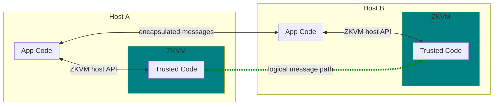
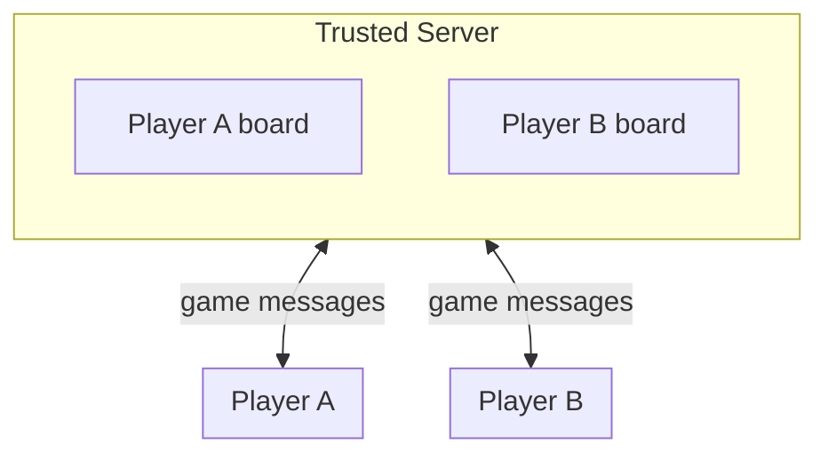
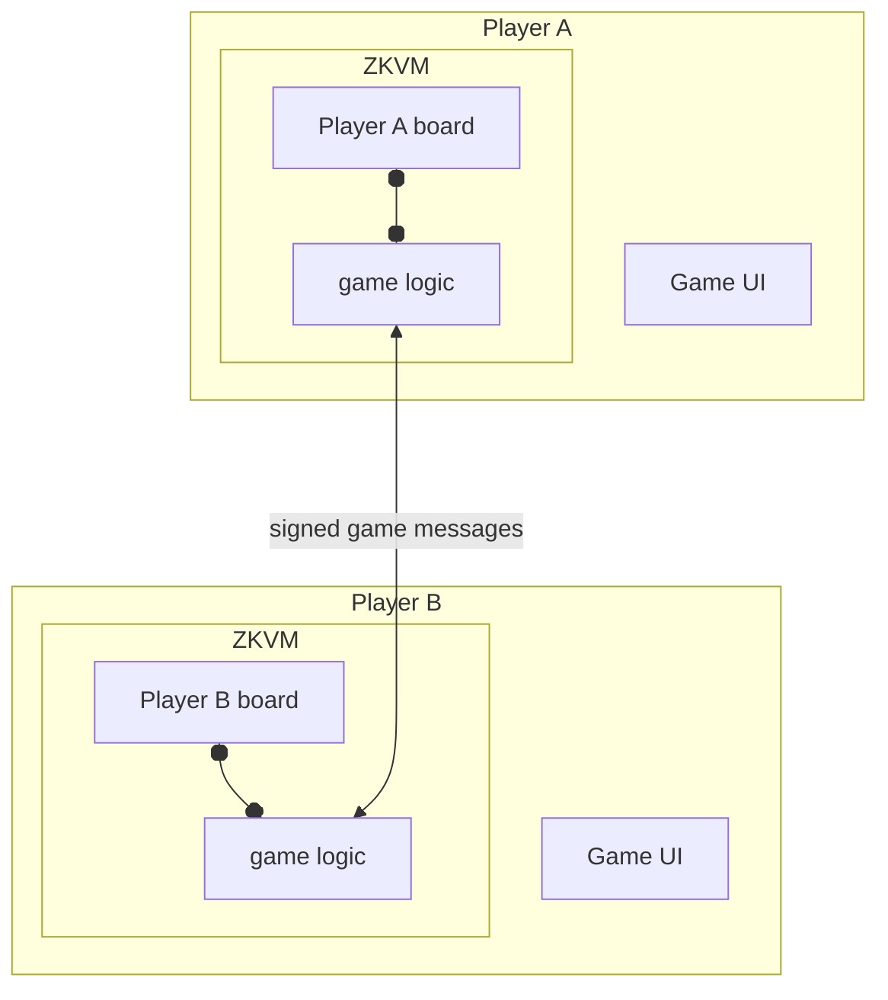
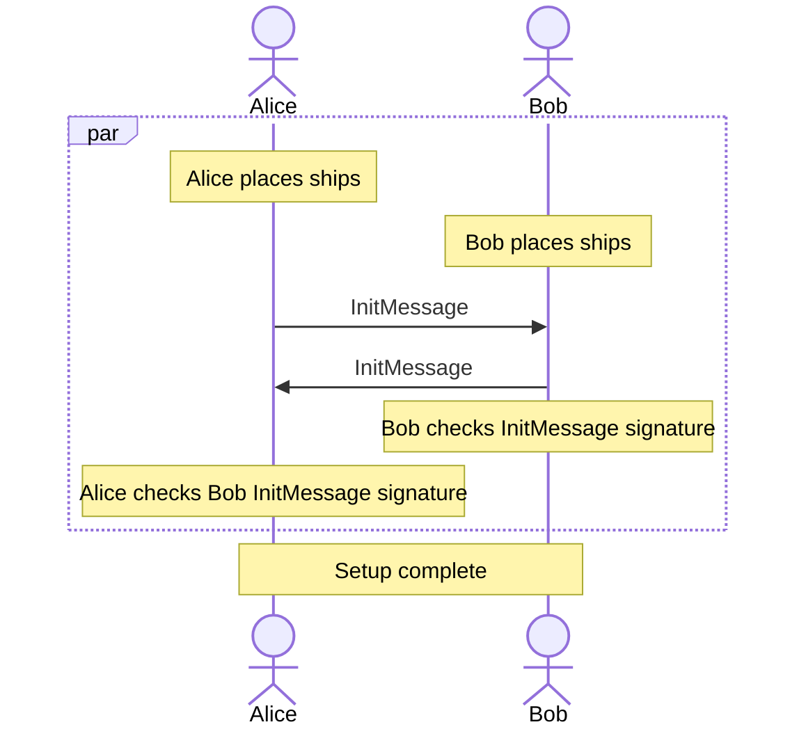

# Battleship on RISC Zero’s technology

*Working draft– see TODOs at bottom*

*Motivation: illustrate application of zkp and RISC Zero tech to a decentralized application with limited trust.*

## Summary

In this introduction to RISC Zero’s technology we outline how to implement a secure, decentralized version of the game *Battleship* using Rust and the RISC Zero virtual machine (ZKVM) and prover. Battleship relies on each player being able to *conceal* the ships on their private game board from their opponent while receiving *accurate* reports from their opponent on the effect of their shots. In a traditional networked application this would be solved by introducing a trusted server to mediate play and hold the game state, and this is representative of existing traditional computing systems. In this implementation we apply the power of *zero knowledge proofs* using the RISC Zero ZKVM to build a server-free version of Battleship in Rust. The players each maintain their private game state, yet every step of the game is cryptographically checked to prevent cheating. The patterns in this code may be applied to build new secure, decentralized applications in finance, governance, information security, etc.

## What is RISC Zero?

RISC Zero is a startup building the RISC Zero ZKVM, a major step towards low cost, secure computing for all. RISC Zero ZKVM bridges the gap between zero knowledge proof (ZKP) research and widely-supported programming languages such as C++ and Rust. ZKP technology enables programs’ output to carry proof of provenance and correct execution that can be cryptographically verified by a receiver without access to the programs’ inputs. This verifiability enables decentralization of applications that previously required a trusted third party, a game changer for the resilience and economics of operating the computing infrastructure that we all rely on. Foundational work such as [TODO cite some here like STARKs] has shown the potential of ZKP-based compute, but to date building applications has required adopting new and esoteric programming languages. RISC Zero is removing those barriers by bringing existing languages, tools, and developer skills to ZKP development.

The way RISC Zero achieves this is by inventing a uniquely high-performance ZKP prover and then using the headroom to build a zero knowledge virtual machine, RISC Zero ZKVM, implementing a standard RISC-V instruction set. By emulating RISC-V RISC Zero’s ZKVM is compatible with existing mature languages and toolchains which greatly improves the developer experience. In concrete terms this looks like seamless integration between “host” application code written in a high level language running natively on the host processor (e.g. Rust on arm64 Mac) and “guest” code in the same language executing inside our ZKVM. This is similar to the very successful pattern used in Nvidia’s CUDA C++ toolchain, but with a ZKP engine in place of a GPU.

[TODO comparison ref: starkware, cartesi: my inclination is actually to not do any comparisons in a tutorial]

## Battleship Gameplay

In this example we’ll walk through an implementation of the popular two player game Battleship. Typically played with concealed physical game boards, a computerized version of the game relies on each party accurately reporting the results of computations on their private board state, and the game logic benefits from implementation in a high-level language. In this way Battleship is a microcosm of the challenges of implementing more complex multi-party limited trust applications.


https://commons.wikimedia.org/wiki/File:The_Harry_S._Truman_Carrier_Strike_Group_DVIDS285915.jpg

Caption: Servicemen play Battleship aboard the aircraft carrier USS Harry S. Truman

Game background: The game starts with two players, each placing their ships on their private board of square grid cells. After placement the ships remain stationery and players take turns attempting to sink them by shelling grid cells until a player has won by sinking their opponent’s ships. Each turn consists of a message exchange, or “round” [TODO change in code], where a player fires at coordinates on their opponent’s board followed by an acknowledgement from the other player containing information about hit or miss, and if a ship has been sunk. Play alternates until a player has lost all their ships.

See Wikipedia for details on the game’s history and rules: https://en.wikipedia.org/wiki/Battleship_(game)

For this implementation of Battleship we’ll be providing the following security properties:

Each player starts the game with the right set of ships placed on their board, no more or fewer (valid setup).

No player changes their ship placement during the game.

Each shot acknowledgement contains an accurate report on whether the shell hit a ship and if so whether a ship sunk.

Each player’s ship placement is confidential during the all message exchanges.

[TODO currently a non-property, we don’t support this but maybe we want to add it later:  A player may prove the validity of a game outcome (for example a win) to a third party. Right now we run the game as two parallel lockstep guessing games but they are not linked.]

## Quick start

To run the example code yourself you’ll need a working build of RISC Zero. RISC Zero works on recent Linux, Mac, or Windows and requires about 5GB free space and seven minutes to do a clean build (tested on MacBook Air). Head over to the main RISC Zero GitHub repo and follow the instructions in the README.md: https://github.com/risc0/risc0

Included in the README is the command to run the Battleship Rust example:

```

RISC0_LOG=1 bazelisk run //examples/rust/battleship:test

```

Running that you should see a lot of debug output ending in a `cargo test` status line similar to below:

```

...

[2022-03-25T20:10:36Z INFO  test] on_round_msg

15.091 (0.002): Reading code id from examples/rust/battleship/proof/turn.id

15.091 (0.000): size = 32768

15.091 (0.000): codeRoot = 8cc48fdcb89c54206c953a070ce9eb199077432ea6a91069413f0e43ee182ee2

15.091 (0.000): dataRoot = 73f950aa4c016353432983182eacbe169bbcaf19db37a3ff637fcf168c4c722c

15.091 (0.000): accumRoot = 150cec08d393b3da406d0c3fa53b79580367c65561d8a3482a60206f75107780

15.091 (0.000): checkRoot = 73e704f2ad051b56710ee19c8f91a751a4c06b85fe13db31b9449ea12d0d71ae

15.091 (0.000): Z = 1838642559+1853296143x+742650868x^2+853030345x^3

15.092 (0.000): Result = 282643219+1641085643x+302170905x^2+186456821x^3

15.092 (0.000): Check = 282643219+1641085643x+302170905x^2+186456821x^3

15.092 (0.000): mix = 1444325494+34230134x+128629049x^2+1427073193x^3

15.092 (0.000): FRI-verify, size = 32768

[2022-03-25T20:10:36Z INFO  test]   commit: RoundCommit { old_state: cd3cbe55c93d4b7b125cb4eddb5ac6b65e3768b433dbacd4b17be5d4df1b9d9b, new_state: c9ee63e880dcfa195bc55d61f6ccf94744154377db7a6ffe1f29049a0cbee6ec, shot: Position { x: 6, y: 1 }, hit: Sunk(1) }

test tests::protocol ... ok


test result: ok. 2 passed; 0 failed; 0 ignored; 0 measured; 0 filtered out; finished in 15.09s


```

If you run into any problems feel free to ask on [Discord](https://discord.gg/bTSc6qdJrd) [TODO we may want a different way to generate Discord links] or check [GitHub Issues]((https://github.com/risc0/risc0/issues).

## RISC Zero operation

You can follow along with the RISC Zero host lib code in [risc0/zkvm/sdk/rust/host/src/lib.rs](https://github.com/risc0/risc0/blob/battleship-tutorial/risc0/zkvm/sdk/rust/host/src/lib.rs).

### Key terminology

- ZKVM – The virtual machine that runs trusted code
- RISC Zero ZKVM – RISC Zero’s ZKVM implementation based on the RISC-V architecture
- host – the system the ZKVM runs on
- guest – the system running inside the ZKVM
- host program – the host-native, untrusted portion of an application
- prover – a program on the host that runs the trusted code to generate a receipt
- verifier – a program on the host that verifies receipts
- method – a single 'main' entry point for code that runs inside the ZKVM
- execute – run a method inside the ZKVM and produce a receipt of correct execution
- commit – append data to the journal
- receipt – a record of correct execution, consisting of:
- method ID – a small unique identifier that identifies a method
- journal – all the things the method wants to publicly output and commit to, written to by the method, attached to receipt.
- seal – the cryptographic blob which proves that the receipt is valid
- verify – check that the receipt is valid, i.e. verify the seal


### Operation overview





The key thing verifiable computation brings to decentralized apps is the ability to distribute trusted logic across peers without relying on a server. Within RISC Zero this is done by putting that logic into an embedded program called the *guest* that runs within a ZKVM hosted inside the user-facing application. During operation a host program *executes* *methods* on the *guest* to manipulate the guest’s internal state. As the guest program executes it may *commit* outputs to transmit to the *journal*. When execution finishes the ZKVM returns to the host program a *receipt* containing the committed journal items along with a cryptographic *seal* that proves the integrity of the result. This receipt can then be sent across a network to another host where the receipt may be checked by the *verifier* and used for further computation.

To see this in action let's look at the Battleship implementation.

## Battleship on RISC Zero ZKVM

As mentioned earlier a traditional pre-ZKP approach to building networked Battleship would be to have both players send commands to a trusted server.


Caption: Traditional networked Battleship design.




In contrast in the server-free version using ZKPs the clients communicate directly with each other, instead trusting cryptographic verification of the receipts they receive to protect the integrity of the game.

Trust model: each turn a player fires a shot and the opponent responds, with r0vm player can new verify the accuracy of the response at each move. This in effect splits the game into two subgames that run lockstep, one for each player. In future work we may join the games together so the winner of any match may prove their win to third parties.





```
examples/rust/battleship
Cargo.toml
proof
proof/Cargo.toml
proof/BUILD.bazel
proof/src
proof/src/.DS_Store
proof/src/bin
proof/src/bin/turn.rs
proof/src/bin/init.rs
proof/src/lib.rs
BUILD.bazel
src
src/lib.rs
src/main.rs
```


[discuss code layout – host vs device code, where game logic lives, where different types live etc]

### Valid Setup

[Discuss how the game gets initialized in a verifiably fair way.]

[alice and bob initialize their boards and transmit signature of game state, once verified both are set up]

<!-- TODO below only renders in newer versions of Mermaid than what Homebrew ships -->



[discuss game data structures, highlight digest]


`lib.rs:40`

```
pub struct Battleship {
    state: GameState,
    last_shot: Position,
    peer_state: Digest,
}
```

Alice creates GameState with ship placements, then calls .init() to produce the InitMessage to send to Bob.

`lib.rs:150`

```
        let alice_state = GameState {
            ships: [
                Ship::new(2, 3, ShipDirection::Vertical),
                Ship::new(3, 1, ShipDirection::Horizontal),
                Ship::new(4, 7, ShipDirection::Vertical),
                Ship::new(7, 5, ShipDirection::Horizontal),
                Ship::new(7, 7, ShipDirection::Horizontal),
            ],
            salt: 0xDEADBEEF,
        };

        let mut alice = Battleship::new(alice_state);
        alice.init();  // produces InitMessage
```


Here’s what an InitMessage looks like. Note it’s just a proof that the state is valid, it doesn’t contain the board itself!


`src/lib.rs:20`

```
pub struct InitMessage {
    proof: Proof,
}
```

This is important because this allows us to prove to Bob our board is set up fairly without showing him. Instead the proof tells him that the board conformed to the requirements in GameState.check() in `proof/src/lib.rs:78`. [right number of ships, non-overlapping, etc]

Below the code for Battleship.init().

`src/lib.rs:70` Battleship.init() and .on_init()

```
    pub fn init(&self) -> Result<InitMessage> {
        let mut prover = Prover::new("examples/rust/battleship/proof/init")?;
        let ptr: *const GameState = &self.state;
        let slice = unsafe { slice::from_raw_parts(ptr.cast(), mem::size_of::<GameState>()) };
        prover.add_input(slice)?;
        let proof = prover.run()?;
        Ok(InitMessage { proof })
    }
```

TODO actually init happens in parallel because the Battleship can be decomposed into two games played in sync.

When Bob receives the InitMessage from Alice his Battleship instance processes the message, verifying the `init` proof that asserts that the Alice’s game state is valid:

`src/lib.rs:7x` Battleship.on_init()

```
    pub fn on_init_msg(&mut self, msg: &InitMessage) -> Result<()> {
        msg.proof.verify("examples/rust/battleship/proof/init")?;
        self.peer_state = msg.get_state()?;
        Ok(())
    }

```

[here’s what’s inside that proof]

[then this below code is running inside the ZK engine, it checks the game state & commits. That allows the host code on the receiver to ask for a proof of valid state after this init has happened]

[TODO what does commit_digest really mean]

`proof/src/bin/init.rs:24`

```
pub fn main() {
    let state: GameState = env::read();
    if !state.check() {
        panic!("Invalid GameState");
    }
    env::commit_digest(&sha::digest(state));
}
```

Bob generates and returns an InitMessage, which Alice verifies in the same way.


### Valid turn

 – [code flow step by step] (then alice & bob init one at a time, passing resulting init messages)

ShotMessage = when the player fires a shot

ShotAckMessage = acknowledgement

### Example: Corrupt message

Failure mode: corrupt message [walk through test code for that]

### Example: Player lies about a hit

Failure mode: player sends inaccurate ack (lies about hit saying it’s a miss) [walk through test code for that]

### Example: Player replays a negative hit

Failure mode: player sends repeat of authentic nack (lies about hit) [walk through test code for that]

### Example: Player tries to send invalid move

Failure mode: player sends invalid move [walk through test code for that]

## Further stuff

[recap and tie to other applications]

[references for further reading]

[engage with us]

---


converting

https://github.com/timofurrer/pandoc-mermaid-filter

```


```

